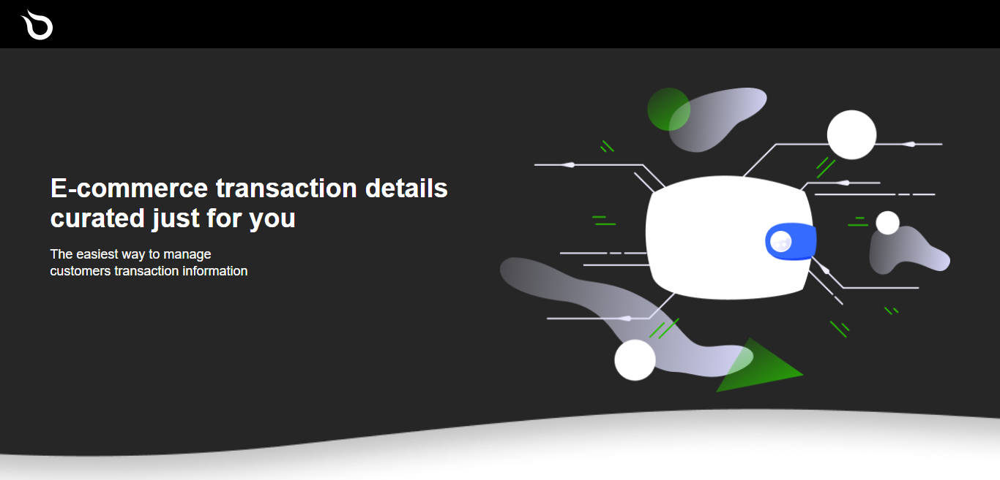

[](https://github.com/prettier/prettier)
[](https://gitlab.com/calvin-puram/product-store/-/blob/master/LICENSE)

### React - Typescript

## Demo



- Web app [demo](https://getproducts.netlify.app/)

## Deployment

- app deployed to netlify

## Getting started

### 1. Clone the repository

```bash
git clone https://gitlab.com/calvin-puram/product-store.git
cd enye-frontend
```

### 2. Install package dependencies

In the `root` directory, run:

```bash
yarn install
```

### 3. Start development servers

To start client

```bash
# In the root directory (server):
yarn start
# Web client is running at http://localhost:PORT (http://localhost:3000 by default)
```
